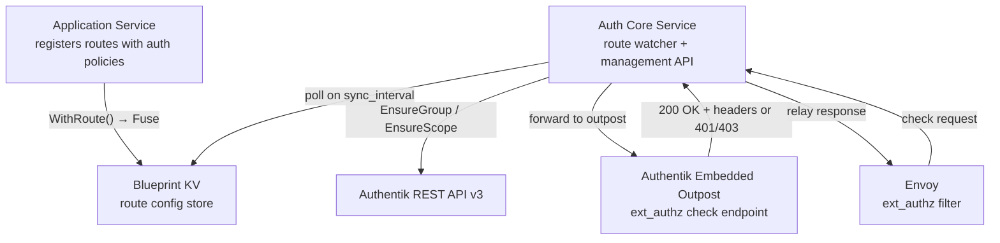
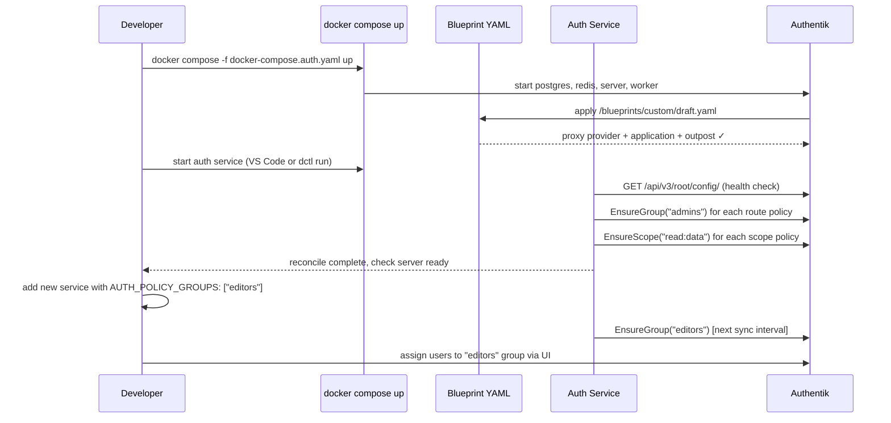

This guide covers the practical steps to get authentication running in a Draft cluster. It assumes you have already read the [Authentication & Authorization](/docs/architecture/authentication) architecture overview and understand the role of the auth core service and Envoy ext_authz.

There are two complementary approaches to configuring Authentik:

| Approach | When to use |
|---|---|
| **Blueprint YAML** | Declarative, commit-once setup applied automatically on `docker compose up`. Best for the foundational configuration — the proxy provider, application, and embedded outpost — that never changes across environments. |
| **Auth Service API** | Runtime management via ConnectRPC. Best for configuration that changes while the system is live — new groups for `AUTH_POLICY_GROUPS` routes, new scopes for `AUTH_POLICY_SCOPES` routes, new service providers as services are added. |

Both approaches work together: the Blueprint YAML lays the foundation on first boot, and the Auth Service API keeps Authentik in sync with the cluster's evolving route policies.

---

## Prerequisites

- Docker and Docker Compose installed
- The Draft monorepo checked out and the core services built (see [Getting Started](/docs/getting-started))
- Two secrets generated and exported in your shell (or stored in `deployments/compose/.env`):

```shell
# Generate once and store securely — do not commit these values
export AUTHENTIK_SECRET_KEY=$(openssl rand -base64 60)
export AUTHENTIK_BOOTSTRAP_TOKEN=$(openssl rand -hex 32)
```

`AUTHENTIK_SECRET_KEY` is Authentik's internal signing secret. `AUTHENTIK_BOOTSTRAP_TOKEN` seeds an API key for the `akadmin` user on first startup; the auth core service uses this same token to call Authentik's management API.



---

## Option 1 — Blueprint YAML (declarative, startup)

Authentik ships a built-in **Blueprint** system: YAML files describing providers, applications, flows, and outpost assignments that Authentik applies idempotently on startup. Mounting a blueprint into the container means `docker compose up` produces a fully configured Authentik with no manual steps.

### What the Draft blueprint creates

The file `deployments/compose/authentik-blueprint.yaml` is mounted into the Authentik server at `/blueprints/custom/draft.yaml`. On startup, Authentik applies it and creates:

1. **Proxy Provider** (`draft-forward-auth`) — forward auth mode. Authentik validates every check request from the Envoy ext_authz filter and injects identity headers (`X-Authentik-Username`, `X-Authentik-Groups`) on allow.
2. **Application** (`Draft`) — the logical identity unit in Authentik. Users and groups are granted access to this application.
3. **Embedded Outpost assignment** — the proxy provider is attached to Authentik's built-in embedded outpost so it handles ext_authz check requests immediately, without deploying a separate outpost process.

### Starting the stack

```shell
# From the root of the draft repository
docker compose -f deployments/compose/docker-compose.auth.yaml up
```

The first time you run this, Authentik will apply the blueprint after its database migrations complete. Watch for a log line like:

```
authentik-server  | ... Successfully applied blueprint 'Draft Framework'
```

### First-time admin setup

After the server starts, open the initial setup wizard in your browser:

```
http://localhost:9050/if/flow/initial-setup/
```

Create the admin account (`akadmin`). Once saved, the `AUTHENTIK_BOOTSTRAP_TOKEN` you set is already active as an API key for this account — no further action is needed.

### Customising the external host

The Proxy Provider's `external_host` is the URL Authentik redirects browsers to after login — the publicly accessible address of your Envoy gateway. It defaults to `http://localhost:10000` (Envoy's default local port). Override it before starting the stack:

```shell
export AUTHENTIK_DRAFT_EXTERNAL_HOST=https://api.example.com
docker compose -f deployments/compose/docker-compose.auth.yaml up
```

### Viewing applied blueprints

In the Authentik UI: **System → Blueprints**. The `draft-framework` entry shows its last apply time and any errors. You can re-trigger a manual apply from this screen.

### PostgreSQL access

The Authentik Postgres instance is exposed on host port `5433` for inspection via DBeaver or `psql`:

```
Host:     localhost
Port:     5433
Database: authentik
User:     authentik
Password: authentik
```

```shell
# Via psql in the container (no port exposure needed)
docker exec -it draft-auth-postgres-1 psql -U authentik -d authentik
```

---

## Option 2 — Auth Service API (dynamic, runtime)

The Blueprint YAML handles static configuration. But as services are added to the cluster — each potentially declaring new group or scope requirements — someone needs to ensure those groups and scopes exist in Authentik before the first request arrives.

The auth core service (`services/core/auth`) is the runtime bridge. In `authentik` mode it:

1. On startup: reads all registered routes from Blueprint KV, reconciles required groups and scopes against Authentik's API, and blocks serving traffic until reconciliation succeeds.
2. In the background: watches Blueprint KV for route changes and reconciles automatically on a configurable interval.
3. Exposes a `AuthManagementService` ConnectRPC API so admin tooling can trigger reconciliation or inspect state on demand.



### Configuration

Enable management mode in the auth service config (`services/core/auth/config.yaml` for local development):

```yaml
service:
  name: auth
  domain: core
  entrypoint: http://localhost:2221

  network:
    bind_address: localhost
    bind_port: 9095
    internal:
      host: host.docker.internal
      port: 9095

auth:
  mode: authentik
  authentik:
    url: http://localhost:9050
    api_token: "${AUTHENTIK_BOOTSTRAP_TOKEN}"   # same token seeded by compose
    external_host: http://localhost:10000        # Envoy public URL for proxy provider
    management:
      enabled: true
      sync_interval: 30s
```

`api_token` is the same `AUTHENTIK_BOOTSTRAP_TOKEN` value you generated in the prerequisites — the auth service reads it from this config (or its environment) and presents it as a Bearer token on every Authentik API call.

### Auth Management API

The auth service exposes a `AuthManagementService` alongside the ext_authz check endpoint. These RPCs are usable from `dctl` or any ConnectRPC client:

| RPC | Purpose |
|---|---|
| `SyncRoutes` | Trigger an immediate full reconcile of all Blueprint routes against Authentik. Returns a report of what was created, updated, or was already present. |
| `EnsureGroup(name)` | Idempotent: create a group in Authentik if it does not exist. Returns the group's Authentik UUID. |
| `EnsureScope(name)` | Idempotent: create an OAuth2 scope mapping if it does not exist. |
| `GetStatus` | Returns Authentik connectivity state and a summary of the last reconcile pass (group count, scope count, last sync time). |

#### Triggering a manual sync

```shell
# Via dctl (once dctl auth subcommand is added)
dctl auth sync

# Or directly via grpcurl
grpcurl -plaintext localhost:9095 \
  core.auth.v1.AuthManagementService/SyncRoutes
```

### Route watcher behaviour

The watcher runs as a background goroutine inside the auth service. Every `sync_interval` (default 30s) it:

1. Lists all service registrations from Blueprint KV
2. For each route with `AUTH_POLICY_GROUPS`: calls `EnsureGroup` for each entry in `required_groups`
3. For each route with `AUTH_POLICY_SCOPES`: calls `EnsureScope` for each entry in `required_scopes`
4. Logs a summary of any changes made

If Authentik is temporarily unavailable, the watcher logs the error and retries on the next interval. The check server continues serving from its last known state — it does not stop accepting ext_authz requests during a failed sync.

### Startup reconciliation

In `authentik` mode the auth service blocks the check server from serving traffic until:

1. Authentik's `/api/v3/root/config/` returns healthy
2. One full reconcile pass completes successfully

This ensures that by the time Envoy's first check request arrives, every group and scope declared in the current route config already exists in Authentik.

---

## Workflow: combining both options

The typical lifecycle for a Draft cluster looks like this:



**Day 1**: Run `docker compose up` → Blueprint YAML creates provider, application, outpost. Visit `http://localhost:9050/if/flow/initial-setup/` to create the admin account.

**Ongoing**: Auth service watcher keeps groups and scopes in sync as services declare new policies. No manual Authentik UI work is needed for group/scope creation — only for assigning users to groups.

---

## Local development without Authentik

For development where you want auth policy enforced in route config but don't want to run the full Authentik stack, set bypass mode:

```yaml
# services/core/auth/config.yaml
auth:
  mode: bypass
```

In bypass mode the auth service returns `200 OK` for every check request and writes `X-Authentik-Username: bypass-user` as a passthrough header. Fuse still enables the ext_authz filter (the auth service is still registered with Blueprint), but no Postgres, Redis, or Authentik process is required.

Switch back to `mode: authentik` and start the compose stack when you need to test real auth flows.

---

## Environment variable reference

| Variable | Required | Description |
|---|---|---|
| `AUTHENTIK_SECRET_KEY` | Yes | Authentik's internal signing secret. Generate with `openssl rand -base64 60`. |
| `AUTHENTIK_BOOTSTRAP_TOKEN` | Yes | Seeds an API key for `akadmin` on first startup. The auth service uses this same value. Generate with `openssl rand -hex 32`. |
| `AUTHENTIK_DRAFT_EXTERNAL_HOST` | No | The public URL of the Envoy gateway. Used in the Proxy Provider as the post-login redirect target. Defaults to `http://localhost:10000`. |

---

## VS Code launch configurations

The `.vscode/launch.json` in the root of the repository includes ready-to-use launch configurations:

| Configuration | What it starts |
|---|---|
| `Auth` | The auth core service (`services/core/auth/main.go`) using `services/core/auth/config.yaml` |
| `Auth Example` | The example auth service (`services/examples/auth/main.go`) for testing BYPASS and GROUPS policies locally |
| `Auth (core + example)` | Compound: starts both `Auth` and `Auth Example` together |

Start Blueprint and Fuse first, then use the `Auth (core + example)` compound to bring up the auth layer.
