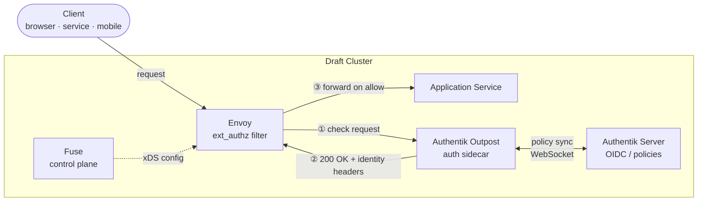
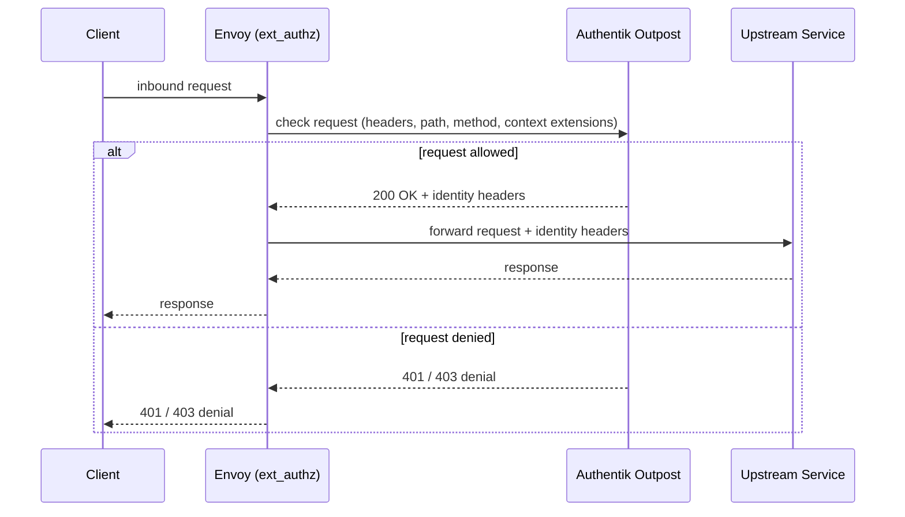
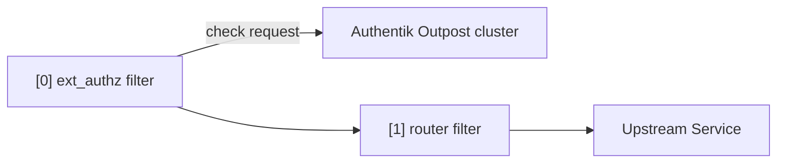
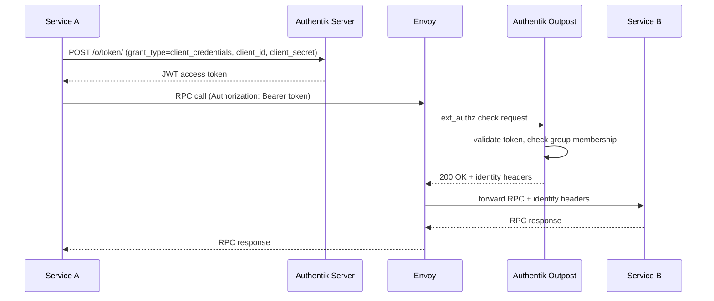
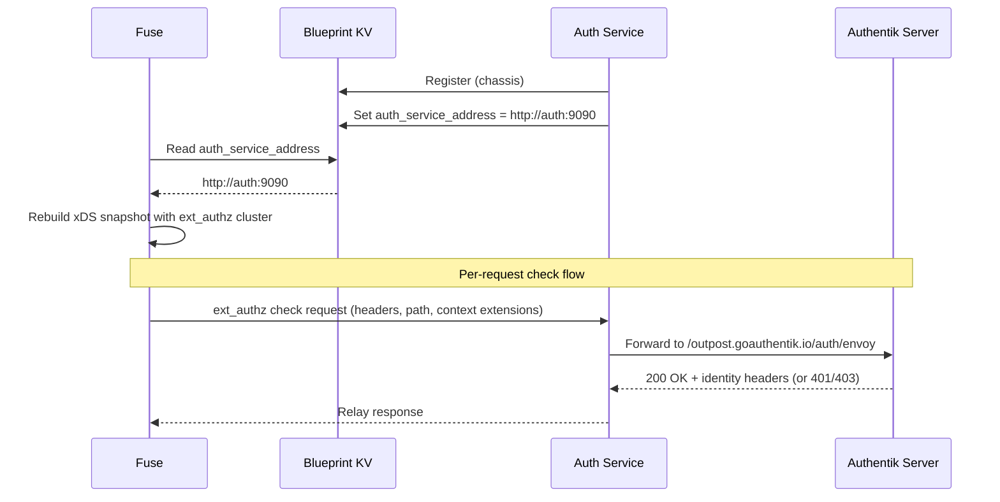
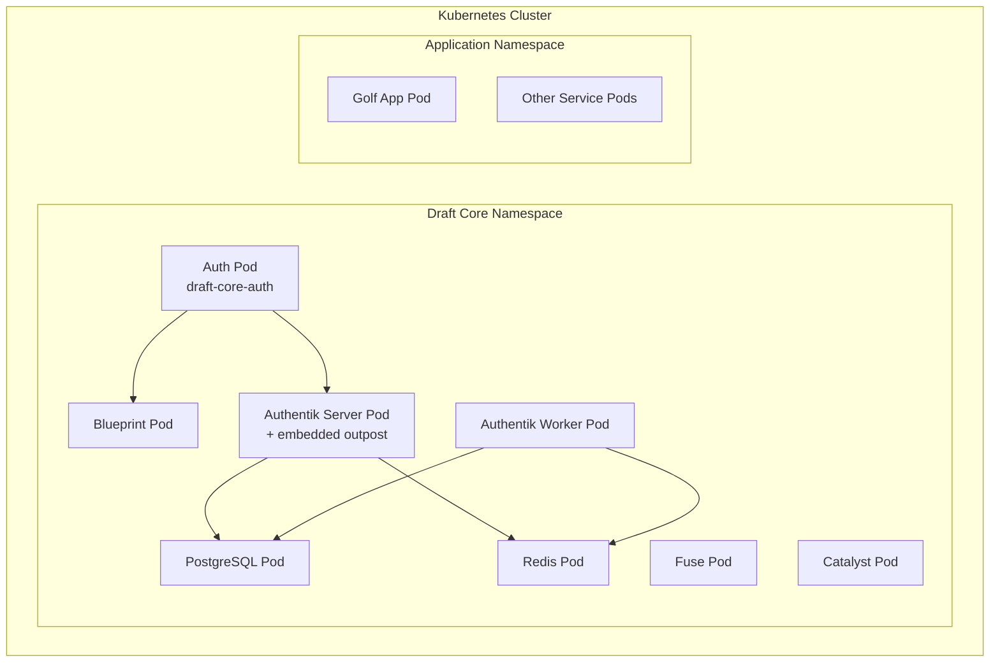

Authentication and authorization in a Draft cluster are handled at the proxy layer by [Envoy](https://www.envoyproxy.io/), controlled dynamically through [Fuse](/docs/architecture/core-services#fuse). Every inbound request — whether from an end-user browser, a mobile client, or another service within the cluster — passes through Envoy before reaching its destination. This gives Draft a single, consistent enforcement point for auth policy regardless of which service or RPC method is being called.

The identity provider is [Authentik](https://goauthentik.io/), an open-source identity platform that handles both human user authentication (SSO, OIDC) and machine-to-machine (M2M) service authentication (OAuth2 `client_credentials` grant, JWT bearer tokens). Authentik is deployed alongside the Draft core services and is itself a registered Draft process.



---

## Why Authentik

[#why-authentik](#why-authentik)

Two identity providers were evaluated: [Authelia](https://www.authelia.com/) and [Authentik](https://goauthentik.io/). Both support Envoy's `ext_authz` HTTP filter, which is the integration point used by Draft. The decision criteria centered on how well each handled the service-to-machine (M2M) use case, because Draft services call each other's RPCs directly and need a first-class way to issue and validate service identities.

| Criteria | Authelia | Authentik |
|---|---|---|
| Envoy ext_authz | Yes (HTTP) | Yes (HTTP, via outpost) |
| Per-route policies | Path/group regex rules | Flows + Expression Policies |
| M2M `client_credentials` | Workaround (username/password) | First-class (`client_id` + `client_secret`) |
| JWT bearer / JWKS federation | Limited | Yes |
| Service account lifecycle | Manual | Auto-provisioned per provider |
| Kubernetes-native deployment | Standalone binary | Outpost model (K8s Deployment) |

Authentik's **outpost model** is the key differentiator. The outpost is a lightweight proxy process deployed as a Kubernetes Deployment that connects to the Authentik server via WebSocket for live policy updates. Envoy routes its auth check requests to the outpost — not the Authentik server directly — which keeps the critical auth check path low-latency and available even if the Authentik server is temporarily unreachable.

Authelia is a reasonable choice for clusters that only need to protect human-facing UIs, but its M2M support is bolted on. Authentik was designed for both human and service identity from the start.

---

## How ext_authz Works

[#how-ext_authz-works](#how-ext_authz-works)

Envoy's [External Authorization filter](https://www.envoyproxy.io/docs/envoy/latest/configuration/http/http_filters/ext_authz_filter) (`ext_authz`) intercepts every inbound HTTP request before it is forwarded to the upstream service. For each request, Envoy forwards a **check request** to the Authentik outpost containing the original request headers, method, path, and any per-route context extensions configured by Fuse. The outpost responds with one of:

- **200 OK** — request is allowed; the outpost adds user identity headers (e.g. `X-Authentik-Username`, `X-Authentik-Groups`) that are forwarded to the upstream service
- **401 / 403** — request is denied; Envoy returns the denial response to the caller without contacting the upstream

This check happens at the HTTP layer, which means it works uniformly for browser requests, REST calls, and ConnectRPC/gRPC calls. ConnectRPC method paths follow the pattern `/package.service.v1.ServiceName/MethodName`, which are plain HTTP paths from Envoy's perspective, so path-based routing and auth policies apply without any special handling.



The `ext_authz` filter is configured on the Envoy **listener** (applied globally to all routes), while each individual route can override the filter behavior via Envoy's `typed_per_filter_config` mechanism. This allows Fuse to declare some routes as public (auth bypassed) and others as protected with specific group or scope requirements — all driven from the same Route configuration that services already register.

---

## Route Auth Configuration

[#route-auth-configuration](#route-auth-configuration)

Authentication policy is declared per-route when a service registers its routes with Fuse. The `Route` proto message in `api/core/control_plane/networking/v1/service.proto` is extended with an optional `RouteAuth` block:

```protobuf
enum AuthPolicy {
  AUTH_POLICY_BYPASS        = 0;  // public — no check
  AUTH_POLICY_AUTHENTICATED = 1;  // any valid token accepted
  AUTH_POLICY_GROUPS        = 2;  // token must carry required_groups
  AUTH_POLICY_SCOPES        = 3;  // token must carry required_scopes
}

message RouteAuth {
  bool        enabled         = 1;
  AuthPolicy  policy          = 2;
  repeated string required_groups = 3;  // e.g. ["admins", "internal-services"]
  repeated string required_scopes = 4;  // OAuth2 scopes required on the token
}

message Route {
  string     name        = 1;
  RouteMatch match       = 2;
  Endpoint   endpoint    = 3;
  bool       enable_http2 = 4;
  RouteAuth  auth        = 5;  // optional; defaults to bypass if absent
}
```

`RouteAuth` is optional. If absent (or `enabled = false`), Fuse generates an `ExtAuthzPerRoute { disabled: true }` Envoy config for that route — no check request is made and the route is treated as public.

---

## Fuse Control Plane Changes

[#fuse-control-plane-changes](#fuse-control-plane-changes)

Fuse's `apply()` function in `services/core/fuse/control_plane/controller.go` already rebuilds and pushes a full Envoy xDS snapshot whenever a route is added. The auth extension adds two new responsibilities to `apply()`:

**1. Global ext_authz cluster and filter**

When Fuse starts, it reads the Authentik outpost address from Blueprint KV (key: `auth_service_address`). This address is added as a cluster to the Envoy snapshot and as an `HttpFilter` on the listener's `HttpConnectionManager`, placed before the router filter:



If no `auth_service_address` is found in Blueprint KV, Fuse omits the ext_authz filter entirely and all routes are effectively public. This preserves backward compatibility for clusters that have not yet deployed Authentik.

**2. Per-route typed_per_filter_config**

When building the route table inside `makeRouterConfig()`, Fuse inspects each route's `RouteAuth` and attaches the appropriate per-route override:

| `RouteAuth` state | Envoy per-route config |
|---|---|
| `auth` absent or `enabled = false` | `ExtAuthzPerRoute { disabled: true }` |
| `AUTH_POLICY_BYPASS` | `ExtAuthzPerRoute { disabled: true }` |
| `AUTH_POLICY_AUTHENTICATED` | `ExtAuthzPerRoute { check_settings: {} }` |
| `AUTH_POLICY_GROUPS` | `ExtAuthzPerRoute { check_settings: { context_extensions: { "required_groups": "admin,ops" } } }` |
| `AUTH_POLICY_SCOPES` | `ExtAuthzPerRoute { check_settings: { context_extensions: { "required_scopes": "read:courses write:scores" } } }` |

Context extensions are forwarded by Envoy to the Authentik outpost inside the check request. Authentik Expression Policies read these extensions and enforce the declared requirements before issuing an allow or deny response.

---

## Chassis API

[#chassis-api](#chassis-api)

Services declare their auth requirements through the existing `WithRoute()` builder on the chassis, extended to accept the new `RouteAuth` field:

```go
chassis.New(logger).
    Register(chassis.RegistrationOptions{
        Namespace: "golf",
    }).
    WithRPCHandler(ctrl).
    // Public read — no auth check
    WithRoute(&ntv1.Route{
        Name: "list-courses",
        Match: &ntv1.RouteMatch{
            Prefix: "/golf.v1.CourseCreator/ListCourses",
        },
        Auth: &ntv1.RouteAuth{
            Policy: ntv1.AuthPolicy_AUTH_POLICY_BYPASS,
        },
    }).
    // Mutating methods require a valid token from an internal service group
    WithRoute(&ntv1.Route{
        Name: "create-course",
        Match: &ntv1.RouteMatch{
            Prefix: "/golf.v1.CourseCreator/CreateCourse",
        },
        Auth: &ntv1.RouteAuth{
            Enabled:        true,
            Policy:         ntv1.AuthPolicy_AUTH_POLICY_GROUPS,
            RequiredGroups: []string{"internal-services", "admins"},
        },
    }).
    Start()
```

The `WithRoute()` implementation in `pkg/chassis/builder.go` already calls `AddRoute` on the Fuse control plane. No changes are needed to the call site — Fuse reads the `auth` field from the proto and handles the rest.

### Per-Method Granularity

Because ConnectRPC paths are `/package.service.v1.ServiceName/MethodName`, registering separate routes for each method gives method-level access control. Envoy selects routes by longest prefix match, so a route for `/golf.v1.CourseCreator/CreateCourse` takes priority over a more general prefix for `/golf.v1.CourseCreator/`. There is no limit to how fine-grained this can be:

```go
// Allow everyone to list
WithRoute(&ntv1.Route{
    Match: &ntv1.RouteMatch{Prefix: "/golf.v1.ShotTracker/ListShots"},
    Auth:  &ntv1.RouteAuth{Policy: ntv1.AuthPolicy_AUTH_POLICY_BYPASS},
})

// Only the owning player or admins can record shots
WithRoute(&ntv1.Route{
    Match: &ntv1.RouteMatch{Prefix: "/golf.v1.ShotTracker/RecordShot"},
    Auth: &ntv1.RouteAuth{
        Enabled:        true,
        Policy:         ntv1.AuthPolicy_AUTH_POLICY_GROUPS,
        RequiredGroups: []string{"players", "admins"},
    },
})
```

---

## Machine-to-Machine Authentication

[#machine-to-machine-authentication](#machine-to-machine-authentication)

Draft services that call other services' RPCs authenticate using Authentik's OAuth2 `client_credentials` grant. Each service is provisioned with a `client_id` and `client_secret` at startup (stored in Blueprint KV or a secret vault plugin), and exchanges them for a short-lived JWT access token:



The chassis will provide a helper in `pkg/chassis` for managing this token lifecycle — fetching a token on first use, caching it for the duration of its `expires_in`, and refreshing before expiry. Services that use this helper need only configure their `client_id` and `client_secret`; token management is transparent.

### Token Forwarding to Upstream Services

When the Authentik outpost allows a request, it adds identity headers that the upstream service can read to learn who the caller is:

| Header | Value |
|---|---|
| `X-Authentik-Username` | The service account name (M2M) or user's username |
| `X-Authentik-Groups` | Comma-separated list of groups the caller belongs to |
| `X-Authentik-Email` | The caller's email (human users) |
| `X-Authentik-Uid` | The caller's unique ID in Authentik |

These headers are set by the outpost and forwarded by Envoy. Services can trust them because they are always stripped by Envoy before the check (callers cannot inject them) and only re-added by the outpost after a successful validation.

---

## Auth Core Service

[#auth-core-service](#auth-core-service)

Authentik is a third-party binary — it has no knowledge of Blueprint and cannot use the Draft chassis to register itself. This creates a gap: Fuse needs to discover the auth endpoint via Blueprint KV (the same pattern used for `fuse_address`), but nothing in the Authentik stack can write that key.

The solution is a new thin Draft core service, `services/core/auth`, that bridges the two worlds:

1. It registers with Blueprint via the standard chassis registration flow, giving it a tracked process identity with health and running state.
2. It serves the Envoy ext_authz HTTP check endpoint on its own port.
3. At startup it writes its own address to Blueprint KV under `auth_service_address`, which Fuse reads to enable the ext_authz filter.
4. It forwards incoming check requests to the configured Authentik endpoint and relays the response back to Envoy.



The auth service supports a **bypass mode** (`auth.mode: bypass`) that returns 200 for every check request without contacting Authentik. This lets developers run a full Draft cluster locally without standing up Authentik's PostgreSQL and Redis dependencies.

### Auth Service Config

```yaml
service:
  name: auth
  domain: core
  entrypoint: http://blueprint:2221
  network:
    bind_address: 0.0.0.0
    bind_port: 9090
    internal:
      host: auth
      port: 9090

auth:
  mode: authentik      # or "bypass" for local dev without Authentik
  authentik:
    url: http://authentik-server:9000
```

Fuse watches for `auth_service_address` in Blueprint KV. When the auth service starts and writes the key, Fuse regenerates the Envoy snapshot to include the ext_authz filter. When the auth service stops and Blueprint marks it unhealthy, Fuse detects the absence on the next poll and falls back to a public-access snapshot.

This means auth is **opt-in at the cluster level**: a Draft cluster without the auth service behaves exactly as it does today — no auth checks, no changes needed to existing services.

---

## Deployment

[#deployment](#deployment)

Within a Kubernetes cluster, the recommended topology is:



The **Auth Service** (`draft-core-auth`) is the only component that registers with Blueprint. It is the ext_authz endpoint that Envoy talks to, and it delegates policy decisions to Authentik.

The **Authentik Server** is the identity backend — it holds users, groups, flows, and policies, and issues tokens. It bundles an embedded outpost (the component the auth service proxies to) so no separate outpost deployment is required. It requires a PostgreSQL database and Redis.

The **Authentik Worker** runs background tasks (policy evaluation caching, token cleanup, flow execution) and must share the same database and Redis as the server.

---

## Implementation Plan

[#implementation-plan](#implementation-plan)

The work is divided into five phases, each independently deployable.

### Phase 1 — Proto Extension

Extend `api/core/control_plane/networking/v1/service.proto` with the `RouteAuth` message and the `auth` field on `Route`. Run `dctl api build` to regenerate Go, Rust, and TypeScript clients. No behavioral changes — existing routes with no `auth` field continue to work as before.

### Phase 2 — Fuse ext_authz Support

Update `services/core/fuse/control_plane/controller.go`:

1. Read `auth_service_address` from Blueprint KV at startup and on change
2. When the address is present, add the auth service as a cluster in the xDS snapshot
3. Add the ext_authz `HttpFilter` to the listener's `HttpConnectionManager` (before the router filter)
4. In `makeRouterConfig()`, generate `typed_per_filter_config` per route based on the `RouteAuth` field

If `auth_service_address` is absent from Blueprint KV, Fuse omits the ext_authz filter entirely and all routes remain public. This means Phase 2 can be deployed before Phase 3 without breaking anything.

### Phase 3 — Auth Core Service

Create `services/core/auth` — a new Draft core service that bridges Blueprint and Authentik.

**Directory layout:**
```
services/core/auth/
  main.go        # chassis registration, writes auth_service_address to Blueprint KV
  handler.go     # ext_authz HTTP check endpoint
  forwarder.go   # proxies check requests to Authentik (or bypass)
  config.go      # typed config struct
```

**Startup sequence:**
1. Register with Blueprint via `chassis.Register()` (same as every other core service)
2. Read `auth.mode` from config — either `authentik` or `bypass`
3. Write own address to Blueprint KV under `auth_service_address`
4. Start serving the ext_authz HTTP endpoint

**Bypass mode** — for local development without Authentik:

```yaml
auth:
  mode: bypass
```

In bypass mode the handler returns `200 OK` for every check request. This lets the full Draft stack run locally with auth enforcement enabled in the route config, but without requiring Postgres, Redis, or Authentik.

**Authentik mode** — for staging and production:

```yaml
auth:
  mode: authentik
  authentik:
    url: http://authentik-server:9000
```

The handler forwards the original request headers to `{authentik.url}/outpost.goauthentik.io/auth/envoy` and relays the response (status code + headers) back to Envoy unchanged.

#### Local Docker Compose

A new `deployments/compose/docker-compose.auth.yaml` layers on top of the existing `docker-compose.yaml` to add Authentik and the auth service:

```yaml
name: draft-auth

services:
  postgres:
    image: docker.io/library/postgres:16-alpine
    restart: unless-stopped
    environment:
      POSTGRES_PASSWORD: authentik
      POSTGRES_USER: authentik
      POSTGRES_DB: authentik
    volumes:
      - postgres:/var/lib/postgresql/data

  redis:
    image: docker.io/library/redis:alpine
    restart: unless-stopped

  authentik-server:
    image: ghcr.io/goauthentik/server:2024.12.3
    restart: unless-stopped
    command: server
    environment:
      AUTHENTIK_REDIS__HOST: redis
      AUTHENTIK_POSTGRESQL__HOST: postgres
      AUTHENTIK_POSTGRESQL__USER: authentik
      AUTHENTIK_POSTGRESQL__PASSWORD: authentik
      AUTHENTIK_POSTGRESQL__NAME: authentik
      AUTHENTIK_SECRET_KEY: ${AUTHENTIK_SECRET_KEY}
    ports:
      - 9000:9000
    depends_on:
      - postgres
      - redis

  authentik-worker:
    image: ghcr.io/goauthentik/server:2024.12.3
    restart: unless-stopped
    command: worker
    environment:
      AUTHENTIK_REDIS__HOST: redis
      AUTHENTIK_POSTGRESQL__HOST: postgres
      AUTHENTIK_POSTGRESQL__USER: authentik
      AUTHENTIK_POSTGRESQL__PASSWORD: authentik
      AUTHENTIK_POSTGRESQL__NAME: authentik
      AUTHENTIK_SECRET_KEY: ${AUTHENTIK_SECRET_KEY}
    depends_on:
      - postgres
      - redis

  auth:
    image: ghcr.io/steady-bytes/draft-core-auth:latest
    restart: unless-stopped
    ports:
      - 9090:9090
    volumes:
      - ./auth.yaml:/etc/config.yaml
    depends_on:
      authentik-server:
        condition: service_started
      blueprint:
        condition: service_started

volumes:
  postgres:
```

With a corresponding `deployments/compose/auth.yaml` config:

```yaml
service:
  name: auth
  domain: core
  entrypoint: http://blueprint:2221
  network:
    bind_address: 0.0.0.0
    bind_port: 9090
    internal:
      host: auth
      port: 9090

auth:
  mode: authentik
  authentik:
    url: http://authentik-server:9000
```

**Starting the full stack locally:**

```shell
# Core Draft services only (no auth)
docker compose -f deployments/compose/docker-compose.yaml up

# Core Draft services + Authentik
AUTHENTIK_SECRET_KEY=$(openssl rand -base64 60) \
  docker compose \
    -f deployments/compose/docker-compose.yaml \
    -f deployments/compose/docker-compose.auth.yaml \
  up
```

Authentik's first-run setup wizard is available at `http://localhost:9000/if/flow/initial-setup/` after the server starts.



### Phase 4 — Authentik Configuration

With Authentik running, configure the identity policies through its UI or Terraform provider:

- An **OIDC provider** for human user SSO (browser login flows)
- An **OAuth2 provider** for M2M `client_credentials` flows, with service accounts for each core Draft service (Blueprint, Catalyst, Fuse, Auth)
- **Expression policies** that read the `required_groups` and `required_scopes` context extensions forwarded by Envoy and enforce group membership or scope requirements before issuing an allow response

Once the auth service is running and `auth_service_address` is written to Blueprint KV, Fuse will automatically enable the ext_authz filter on the next snapshot push.

### Phase 5 — Chassis M2M Helper

Add a token manager to `pkg/chassis` that:

1. Reads `client_id` and `client_secret` from the service's config (or secret vault plugin)
2. Fetches a JWT from Authentik on first outbound RPC call
3. Caches the token until `expires_in - 30s`
4. Injects `Authorization: Bearer <token>` into outbound ConnectRPC requests

Services opt in by calling a new builder method:

```go
chassis.New(logger).
    Register(...).
    WithM2MAuth(chassis.M2MAuthOptions{
        TokenURL:     "http://authentik-server:9000/application/o/token/",
        ClientID:     cfg.ClientID,
        ClientSecret: cfg.ClientSecret,
    }).
    Start()
```

---

## Open Questions

[#open-questions](#open-questions)

The following items require further investigation before or during implementation:

- **Outpost and HTTP/2 trailers**: ConnectRPC error responses use HTTP trailers. Verify that the Authentik outpost correctly handles the HTTP/2 framing used by Envoy when proxying ConnectRPC denials (4xx responses with gRPC status trailers).
- **Core service auth**: Blueprint, Catalyst, and Fuse call each other during startup, before Authentik is available. The startup order and whether core-to-core calls need auth at all must be decided. The simplest approach is to exempt the internal cluster network CIDR from ext_authz checks using Envoy's `peer_is_trusted_cluster` configuration.
- **Token propagation across service hops**: If Service A calls Service B which calls Service C, does Service B forward the original token or present its own service identity to C? A consistent policy needs to be defined.
- **Secret storage for client credentials**: `client_id` and `client_secret` should not be in plaintext config. The chassis secret vault plugin (if available) or Kubernetes Secrets should be used.
- **Auth service HA**: In a multi-node Draft cluster, determine the recommended number of auth service replicas and how Fuse's Envoy cluster config should reference them (single Service VIP vs. strict DNS EDS). Authentik itself is stateless between requests (policy state lives in its PostgreSQL + Redis), so the auth service can be replicated freely once those dependencies are HA.
